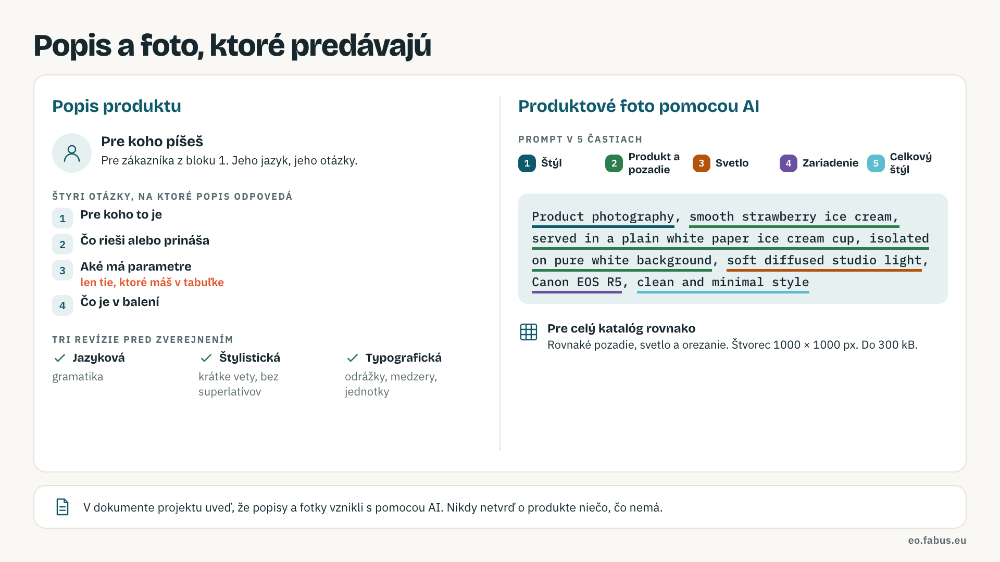

# Logo a produktové foto pomocou AI

Návod pre blok 4 (logo) a blok 5 (fotky produktov). AI navrhuje, ty rozhoduješ: každý výstup skontroluj podľa pravidiel nižšie a v dokumente projektu uveď, že vznikol s pomocou AI. Všeobecné pravidlá sú v [AI v predmete](ai-v-predmete.md).

## Logo

### 1. Šablóna promptu

Prompt na logo má štyri časti v tomto poradí: **subjekt** (druh loga a čo zobrazuje), **štýl a médium**, **farby**, **technické parametre**. Vyplnený príklad pre fiktívnu firmu Kávová pražiareň:

```text
kombinované logo pre Kávovú pražiareň, kávové zrnko, minimalistické, plochý vektor, dve farby, tmavohnedá a krémová, biele pozadie, štvorec, vysoké rozlíšenie
```

### 2. Druhy loga

- **Wordmark**: názov firmy vo výraznom písme.
- **Lettermark**: iniciály namiesto celého názvu.
- **Symbol**: samostatná ikona bez textu.
- **Emblém**: názov vnútri tvaru, štítu alebo kruhu.
- **Kombinácia**: symbol a názov, fungujú spolu aj zvlášť.

Pre malý e-shop sa hodí **wordmark alebo kombinácia**: názov musí byť čitateľný v hlavičke e-shopu, na bannere aj vo favicone.

### 3. Dva typy modelov

Jedny modely rozumejú celým vetám v prirodzenom jazyku, druhé pracujú s kľúčovými slovami oddelenými čiarkami. Ktorý typ máš pred sebou, zistíš rýchlo: zadaj ten istý prompt oboma spôsobmi a nechaj si ten zápis, ktorý dáva presnejší výsledok.

### 4. Váha slov zľava doprava

Model dáva najväčší význam začiatku promptu. Najdôležitejšie slovo (druh loga a firma) je prvé, doladenie a zákazy patria na koniec.

### 5. Škálovateľnosť a favicon test

Logo musí fungovať od favicony po billboard. Zmenši ho na 32 × 32 px: ak je stále rozpoznateľné, obstojí všade. Ak nie, uber detaily.

{ width="160" }

### 6. Negatívny prompt

Zoznam toho, čo v obrázku nechceš: `no 3D effect, no shadows, no text, no gradient`. Použi ho, keď model pridáva text do loga, gradienty, fotorealizmus alebo viac objektov. Niektoré nástroje negatívny prompt nemajú, vtedy zákaz napíš vetou na koniec promptu.

### 7. Limit dĺžky promptu

Do 30 až 40 slov. Dlhý prompt model rozptýli a dôležité slová stratia váhu. Jedna vlastnosť za slovo, bez opisných viet.

### 8. Bezplatné nástroje

Stav k septembru 2026, limity a licencie sa menia. Vyberaj podľa troch kritérií: **bezplatný limit** (koľko obrázkov denne alebo mesačne), **komerčné použitie výstupu** (či smieš logo použiť pre firmu) a **možnosť negatívneho promptu**.

| Nástroj | V čom je silný | Bezplatne | Pozor na |
|---|---|---|---|
| Ideogram | text v logu, názov firmy bez preklepov | denné kredity | komerčné použitie podľa plánu |
| Recraft | vektorový výstup (SVG), štýly značky | denné kredity | vektor over v editore |
| Microsoft Designer | jednoduchý, prirodzený jazyk | zadarmo s Microsoft účtom | bez negatívneho promptu |
| Adobe Firefly | trénovaný na licencovaných dátach | mesačné kredity | komerčne bezpečný výstup |
| Stable Diffusion | bez limitov, negatívny prompt, plná kontrola | open source, lokálne | potrebuje výkonný počítač |

### 9. Reverzné inžinierstvo

Nahraj logo, ktoré sa ti páči, a nechaj si ho opísať ako prompt: v Midjourney príkaz `/describe`, v chate „opíš tento obrázok ako prompt“. Z výsledku sa nauč slovník: štýl, médium, farby. Cudziu značku nekopíruj, uč sa len spôsob zápisu.

### 10. Čo po vygenerovaní

1. Export do PNG s priehľadným pozadím.
2. Vektorizácia (napr. v Recraft alebo online nástroji), aby sa logo dalo zväčšiť bez straty kvality.
3. Kontrola, že logo nekopíruje existujúcu značku: vyhľadaj obrázkom.
4. Poznámka do dokumentu projektu, že logo vzniklo pomocou AI a čo si upravil.

## Produktové foto

### Štruktúra promptu v piatich častiach

1. **Štýl**: product photography.
2. **Produkt a pozadie**: čo je na fotke a na čom leží.
3. **Svetlo**: soft diffused studio light.
4. **Zariadenie**: názov fotoaparátu dáva modelu predstavu o kvalite.
5. **Celkový štýl**: clean and minimal style.

### Vzorový prompt

```text
Product photography, smooth strawberry ice cream, served in a plain white paper ice cream cup, isolated on pure white background, soft diffused studio light, Canon EOS R5, clean and minimal style
```

Rozbor: *Product photography* je štýl, *smooth strawberry ice cream … pure white background* je produkt a pozadie, *soft diffused studio light* je svetlo, *Canon EOS R5* je zariadenie, *clean and minimal style* je celkový štýl.

[{ .tw-infografika }](../img/infografiky/05-popis-a-foto-produktu.png){ target="_blank" }

<p class="tw-infografika-popis">Rovnaké pozadie a svetlo pre celý katalóg, štvorec 1000 × 1000 px, do 300 kB. <a href="../img/infografiky/05-popis-a-foto-produktu.png" target="_blank">Otvoriť v plnej veľkosti</a></p>

### Pravidlá pre e-shop

- Rovnaké pozadie a osvetlenie pre všetky produkty, aby katalóg pôsobil jednotne.
- Štvorec 1000 × 1000 px, do 300 kB (nadväzuje na blok 5, krok 5).
- V dokumente projektu uveď, že fotky sú generované.
- Nikdy negeneruj fotku, ktorá tvrdí niečo, čo produkt nemá: iná farba, iné balenie, doplnky, ktoré sa nepredávajú.

!!! tip "AI v tomto bloku"
    **Čo jej zveriť:** návrh promptu pre tvoju firmu.

    ```text
    Navrhni 3 prompty na kombinované logo pre firmu [názov, čo predáva]. Každý do 35 slov, v poradí: subjekt, štýl a médium, farby, technické parametre. Pridaj negatívny prompt. Nepoužívaj názvy existujúcich značiek.
    ```

    **Čo si overiť:** favicon test a to, že logo nepripomína existujúcu značku. Vyhľadaj obrázkom skôr, než ho použiješ.

!!! note "Ako je to v praxi"
    Logo od grafika stojí malú firmu rádovo stovky až tisíce eur a dostane k nemu logomanuál (farby, písma, pravidlá použitia). Produktové fotenie sa platí za kus alebo za deň v štúdiu, rádovo desiatky eur za produkt. AI tieto náklady zníži na hodiny práce, kontrolu kvality a autorských práv ale neurobí za teba.
